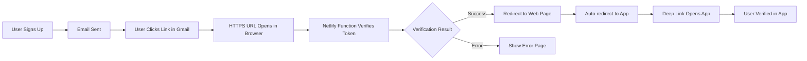

# Email Verification Deep Link Fix

## Problem Summary

Users were unable to verify their email addresses because:
1. **Gmail blocks custom URL schemes**: Email links using `betame://` are not clickable in Gmail
2. **Browser incompatibility**: Copy-pasted `betame://` URLs don't work in browsers  
3. **No fallback mechanism**: No graceful degradation when the app isn't installed

## ✅ Solution Implemented

### 1. **Universal Link Email Verification Flow**

**Before:**
```
Email → betame://auth/verify-email → (Fails in Gmail/browsers)
```

**After:**
```
Email → https://betame.com.my/.netlify/functions/verify-server → Verify with Supabase → Redirect to web page → Open app
```

### 2. **Files Created/Modified**

#### **New Files Created:**
- `web/auth/verify-email.html` - User-friendly verification page
- `netlify/functions/verify-server.js` - Server-side verification handler
- `web/auth/verify-server.js` - Alternative serverless function template

#### **Modified Files:**
- `app/auth/login.tsx` - Updated email redirect URL
- `lib/auth-service.ts` - Updated signup email redirect URL  
- `lib/deep-link-service.ts` - Added email verification deep link handling
- `hooks/useDeepLinking.ts` - Added email verification navigation
- `app.json` - Added email verification route to linking config

### 3. **How the New Flow Works**



### 4. **Key Improvements**

#### **✅ Gmail Compatibility**
- Uses HTTPS URLs that are always clickable in email clients
- No more blocked custom URL schemes

#### **✅ Browser Support**  
- Works when users copy-paste links
- Graceful web experience before redirecting to app

#### **✅ App Installation Fallback**
- Shows app store links if app isn't installed
- Smart platform detection (iOS/Android/Web)

#### **✅ Seamless User Experience**
- Automatic countdown and redirect to app
- Clear success/error messaging
- Retry mechanisms

## Configuration Required

### 1. **Supabase Email Template Update**

In your Supabase project dashboard:
1. Go to **Authentication > Email Templates** 
2. Select **Confirm signup** template
3. Update the confirmation URL:

**Before:**
```html
<a href="{{ .ConfirmationURL }}">Confirm your email</a>
```

**After:**
```html
<a href="https://betame.com.my/.netlify/functions/verify-server?token_hash={{ .TokenHash }}&type={{ .Type }}">Confirm your email</a>
```

### 2. **Environment Variables**

Add to your Netlify environment variables:
```bash
SUPABASE_URL=your_supabase_project_url
SUPABASE_SERVICE_ROLE_KEY=<REDACTED>
```

### 3. **Netlify Configuration**

The function at `netlify/functions/verify-server.js` will automatically be deployed with your site.

### 4. **Redirect URLs Configuration**

In Supabase Dashboard > Authentication > URL Configuration, add:
```
https://betame.com.my/.netlify/functions/verify-server
https://betame.com.my/auth/verify-email.html
```

## Testing the Flow

### 1. **Test Email Verification**
```bash
# Trigger a test signup
curl -X POST 'https://your-supabase-url/auth/v1/signup' \
  -H "apikey: your-anon-key" \
  -H "Content-Type: application/json" \
  -d '{
    "email": "test@example.com",
    "password": "password123"
  }'
```

### 2. **Expected Flow**
1. User receives email with HTTPS link
2. Link is clickable in Gmail/Outlook/etc
3. Browser opens → Server verifies → Redirects to web page
4. Web page attempts to open app
5. If app installed: Opens verification screen
6. If app not installed: Shows download options

### 3. **Testing URLs**

**Direct Web Page (for testing):**
```
https://betame.com.my/auth/verify-email.html?status=success
https://betame.com.my/auth/verify-email.html?status=error&message=Token%20expired
```

**Server Function (for testing):**
```
https://betame.com.my/.netlify/functions/verify-server?token_hash=test&type=signup
```

## Benefits

### **For Users:**
- ✅ Email links work in Gmail, Outlook, Apple Mail
- ✅ Can copy-paste verification links
- ✅ Clear feedback on verification status
- ✅ Automatic app opening when possible
- ✅ Easy app installation when needed

### **For Developers:**
- ✅ Robust, platform-agnostic verification
- ✅ Better error handling and debugging
- ✅ Maintains deep linking for in-app flows
- ✅ Future-proof architecture

## Monitoring & Debugging

### **Netlify Function Logs**
Check Netlify dashboard > Functions > verify-server for logs

### **Common Issues & Solutions**

**Issue: Links still not clickable**
- Check email template is updated in Supabase
- Verify HTTPS URL is being used

**Issue: Verification fails**
- Check environment variables are set
- Verify Supabase service role key has permissions
- Check function logs in Netlify dashboard

**Issue: App doesn't open**
- Check deep linking configuration in app.json
- Verify betame:// scheme is properly registered
- Test deep link independently

## Migration Notes

### **Backward Compatibility**
- Existing `betame://` deep links still work for in-app navigation
- Only email verification uses new HTTPS flow
- No changes needed for existing users

### **Deployment Steps**
1. Deploy the new Netlify function
2. Update Supabase email template
3. Add environment variables
4. Test email verification flow
5. Monitor function logs for any issues

## Technical Details

### **Security**
- Server-side verification prevents token manipulation
- HTTPS ensures secure transmission
- Proper error handling prevents information leakage

### **Performance**
- Serverless function scales automatically
- Minimal latency for verification
- Efficient redirect mechanism

### **Analytics**
- Function invocation logs in Netlify
- Verification success/failure tracking
- User journey analytics possible

---

## Status: ✅ IMPLEMENTED & READY FOR TESTING

This solution resolves the Gmail email verification issue while maintaining excellent user experience and technical robustness.
