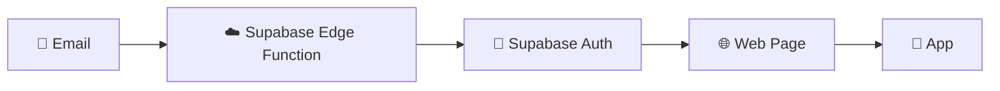

# Email Verification with Supabase Edge Functions

## ✅ Supabase-Only Solution

Instead of using Netlify Functions, we can use **Supabase Edge Functions** to keep everything in one place.

## 🚀 Setup Instructions

### 1. **Deploy the Edge Function**

```bash
# Make sure you're in your project root
npx supabase functions deploy verify-server
```

### 2. **Add Environment Variables to Supabase**

**Location:** Supabase Dashboard → **Edge Functions** → **Settings** → **Secrets**

Add these variables:
```bash
SUPABASE_URL=https://rkcfgebgpixgfvggbwmc.supabase.co
SUPABASE_SERVICE_ROLE_KEY=<REDACTED>
```

### 3. **Update Supabase Redirect URLs**

**Location:** Supabase Dashboard → **Authentication** → **URL Configuration** → **Redirect URLs**

Add these URLs:
```
https://rkcfgebgpixgfvggbwmc.supabase.co/functions/v1/verify-server
https://betame.com.my/auth/verify-email.html
```

### 4. **Update Email Template**

**Location:** Supabase Dashboard → **Authentication** → **Email Templates** → **Confirm signup**

```html
<h2>Confirm your signup</h2>
<p>Welcome to BetaMe! Please confirm your email address to complete your registration.</p>
<p>
  <a href="https://rkcfgebgpixgfvggbwmc.supabase.co/functions/v1/verify-server?token_hash={{ .TokenHash }}&type=signup" 
     style="display: inline-block; padding: 12px 24px; background-color: #3B82F6; color: white; text-decoration: none; border-radius: 6px; font-weight: bold;">
    Confirm Your Email
  </a>
</p>
<p>If the button doesn't work, copy and paste this link into your browser:</p>
<p><code>https://rkcfgebgpixgfvggbwmc.supabase.co/functions/v1/verify-server?token_hash={{ .TokenHash }}&type=signup</code></p>
<p>This link will expire in 24 hours for security reasons.</p>
<p style="margin-top: 20px; font-size: 12px; color: #666;">
  This link will verify your email and automatically open the BetaMe app if you have it installed, or help you download it if you don't.
</p>
```

## 🏗️ Architecture



## ✅ Benefits of Supabase-Only Approach

### **Simpler Setup:**
- ✅ Everything in one dashboard
- ✅ No need for Netlify configuration
- ✅ Integrated with your existing Supabase project

### **Better Performance:**
- ✅ Direct connection to Supabase Auth
- ✅ No external API calls
- ✅ Lower latency

### **Easier Maintenance:**
- ✅ One place to manage secrets
- ✅ Integrated logging and monitoring
- ✅ Consistent with your other Supabase functions

## 🔧 Deployment Commands

```bash
# Deploy the function
npx supabase functions deploy verify-server

# Check function logs
npx supabase functions logs verify-server

# Test the function locally (optional)
npx supabase functions serve verify-server
```

## 🧪 Testing

**Test the edge function:**
```
https://rkcfgebgpixgfvggbwmc.supabase.co/functions/v1/verify-server?token_hash=test&type=signup
```

**Test the complete flow:**
1. Sign up a new user
2. Check email (should have clickable link)
3. Click link → Should redirect to verification page
4. Verification page should auto-redirect to app

## 🔐 Security Notes

- **Environment variables** are securely stored in Supabase
- **Service role key** has the necessary permissions for email verification
- **CORS** is properly configured for web requests
- **Redirect URLs** are whitelisted in Supabase Auth

## 📊 Monitoring

Check function performance and logs:
**Supabase Dashboard** → **Edge Functions** → **verify-server** → **Logs**

---

## 🎯 Summary

This approach keeps everything within Supabase:
- ✅ **Environment Variables**: Supabase Edge Functions Secrets
- ✅ **Function Hosting**: Supabase Edge Functions  
- ✅ **Auth Configuration**: Supabase Auth Settings
- ✅ **Monitoring**: Supabase Dashboard

Much cleaner than splitting between Netlify and Supabase! 🚀
